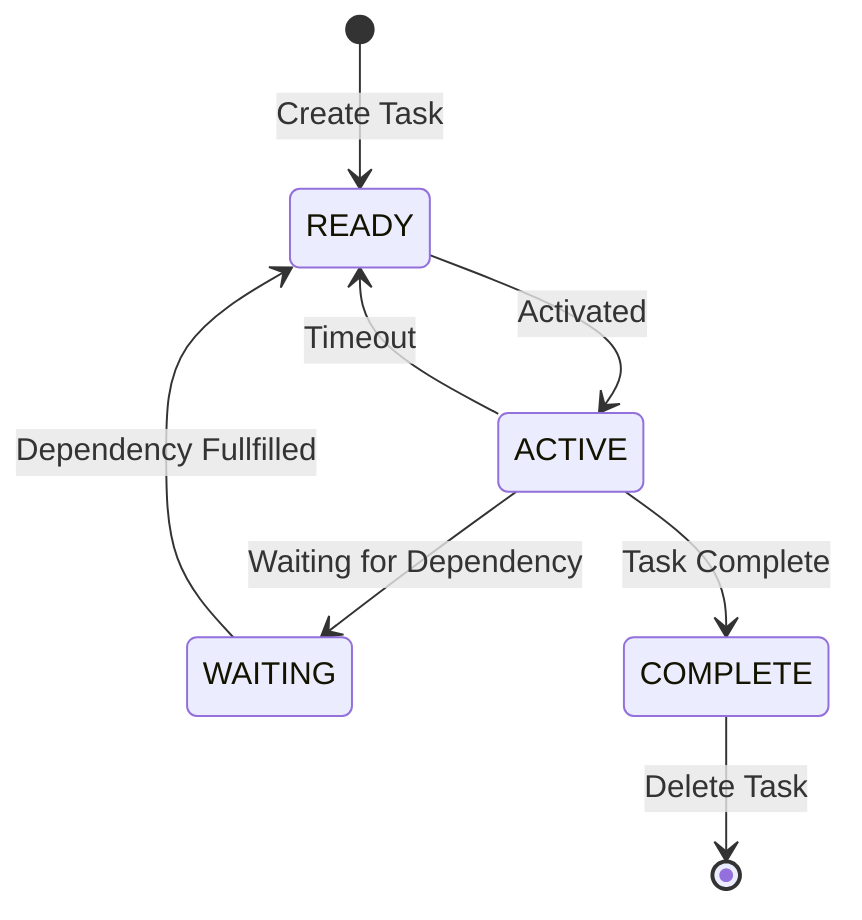

# Task States

State | Description
---|---
READY | Task is ready to be activated, after being: a. creation b. timeout c. dependency fullfilled
ACTIVE | Task is currently active and running on one of the worker xPU
WAITING | Task has a dependency that is not yet fulfilled, e.g. a pending memory access response, and hence task execution has suspended
COMPLETE | Task has completed executing and has therefore been suspended. However, the task creator has not yet consumed the task output, or deleted the task